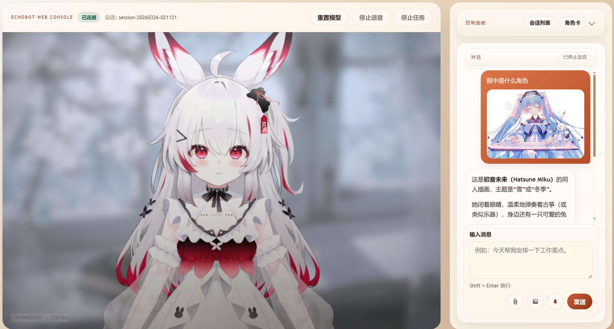
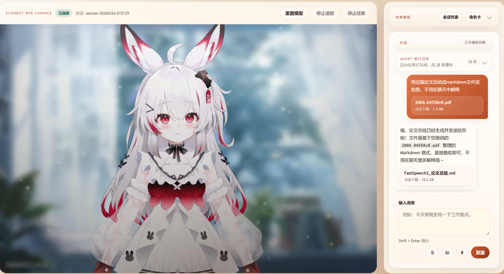
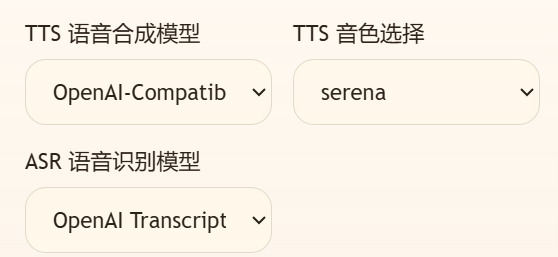

<div align="center">


</div>

# EchoBot: 二次元 AI 小助手

[](https://www.python.org/downloads/)
[](https://opensource.org/licenses/MIT)

> [English README](./README_EN.md)

**EchoBot** 是一款支持 Live2D 的二次元 AI 小助手。它不仅能为你提供具有沉浸感的角色扮演与情感陪伴，还能在后台默默为你处理写代码、文件整理等复杂的 Agent 生产力任务 (๑>ᴗ<๑)。

无论是网页端（支持实时语音与 Live2D 交互），还是聊天平台（支持 QQ、Telegram 接入），小助手都能随时随地响应你的呼唤喵~

<p align="center">
  
</p>

> 展示所用的 Live2D 模型来自：[【免费模型】这么可爱的小狗免费带回家！](https://www.bilibili.com/video/BV1LM41137vK)

---

## ✨ 核心特性

* **🎭 沉浸式 Live2D 交互**：支持网页端 Live2D 渲染与实时语音对话，打破次元壁。
* **🧠 决策-扮演-执行 三层架构**：彻底隔离“角色扮演”与“工具调用”，保证快速回复且人设不崩。
* **🛠️ 硬核生产力**：支持本地文件读写、定时与周期任务、Skills、长期记忆等能力，真正帮你解决复杂需求。
* **🌐 多平台接入**：开箱即用的 WebUI，并无缝支持 QQ、Telegram 聊天平台。

---

## 🏗️ 核心架构

常见的 AI Agent 由于需要载入庞大的工具列表和技能系统，天然耗费 Token 且响应缓慢。如果将角色设定与任务指令混杂，不仅容易导致“人设稀释”，还会严重拖累执行效率。

EchoBot 采用 **Decision - Roleplay - Agent** 三层架构来解决这一痛点：

### 1. 🧠 Decision Layer (决策层)
负责精准、快速地判断用户意图。
* **混合意图识别**：采用 `规则 + 轻量 LLM` 双引擎。明确指令直接跳过大模型触发后台任务；模糊意图则交由轻量级 LLM 分类。
* **智能分发**：日常闲聊交由 **Roleplay 层**；复杂任务则静默唤醒 **Agent Core**，同时让 Roleplay 层告诉用户已经开始任务。

### 2. 🎭 Roleplay Layer (角色扮演层)
专注于提供情感价值与沉浸感(๑˃̵ᴗ˂̵) ♡。
* **纯净上下文**：剥离繁杂的 Tool-use 和 Skills 等元数据，专为文本/语音生成优化，确保语气生动、回复极速，不会OOC。
* **情境感知**：根据系统当前状态（如闲聊中、后台任务启动、任务完成等）智能切换专属话术。

### 3. ⚙️ Agent Core (后台任务层)
在后台静默运行，完成用户指派的任务。
* **完整 Agent 能力**：集成工具链 (Tools)、技能库 (Skills) 以及长短期记忆 (Memory)等能力。
* **系统级权限**：具备操作系统和本地文件读写等高级权限。
* **异步协同**：任务完成后自动整理成果回传，由你的二次元助手亲自向你汇报。

---

## 🔄 工作流示例

**情景 A：日常闲聊**
> 🧑‍💻 **你**：“早上好呀！”
> 🤖 **Decision 层**：(判定为日常聊天) ➔ 转发给 Roleplay 层。
> 🌸 **Roleplay 层**：“早安，今天也要元气满满喵~”

**情景 B：复杂任务请求**
> 🧑‍💻 **你**：“帮我用 Python 写一个爬虫脚本。”
> 🤖 **Decision 层**：(规则命中) ➔ 触发双线操作。
> 🌸 **Roleplay 层** (立刻秒回)：“收到！本喵这就帮你写一个爬虫喵~”
> ⚙️ **Agent Core** (后台静默执行)：调用搜索工具 ➔ 编写代码 ➔ 测试代码 ➔ 执行完毕回传结果。
> 🌸 **Roleplay 层**：“久等啦！这是你要的爬虫脚本，我可是写得很用心的喵，快看看吧~ [附带代码文件]”

---

## 🚀 快速开始

💡 *Tip: 想要最快跑通项目？直接将本仓库交给 Codex、Claude Code 或 Cursor 等 Coding Agent 帮你一键配置喵(≧∇≦)/*

### 安装依赖

推荐使用 Python 3.11 及以上版本

```shell
pip install -r requirements.txt
```

### 配置.env文件

复制`.env.example`文件并重命名为`.env`，填入你的 LLM 供应商信息（兼容 OpenAI 格式）：

```text
LLM_API_KEY=your_api_key_here
LLM_MODEL=deepseek-chat
LLM_BASE_URL=https://api.deepseek.com/v1
```

### 启动服务

运行以下命令将同时启动聊天平台 Gateway 和网页端：

```shell
python -m echobot app
```

### 开始体验

打开浏览器访问以下地址，与你的小助手见面吧(≧◡≦) ♡：

```text
http://127.0.0.1:8000/web
```

## 🎨 个性化配置

### 👗 导入/切换 Live2D 模型

一个完整的 Live2D 资源文件通常是一个文件夹，包含 `.model3.json` 等文件。项目中已内置 2 个 Live2D 资源文件，可以通过网页端的控制面板直接上传或切换模型：

<p align="center">
  
</p>


上传完成后，小助手会自动将上传的文件夹复制到 `.echobot/live2d` 目录下。也可以手动将Live2D 资源文件夹复制到这个文件夹，小助手在下次启动的时候会自动加载。

Live2D 默认开启眼神鼠标跟随的功能，可在面板中关闭。

### 🖼️ 导入/切换背景

同样可以通过网页端的控制面板上传你喜欢的背景图片：

<p align="center">
  
</p>

### 🖼️ 图像上传与下载

对于支持视觉理解的模型（例如`qwen3.5-plus`，`kimi-k2.5`
），可以直接发送图片给小助手，小助手也可以发送图片给你喵~

> 💡 **提示**：如果接入的模型**不支持**视觉输入，建议在项目的 `.env` 文件中配置 `ECHOBOT_LLM_SUPPORTS_IMAGE_INPUT=false`，减少小助手的误操作喵~

<p align="center">
  
  
</p>

> 展示所用的 Live2D 模型来自：[【超精致Live2D量贩模型】兔兔这么可爱，当然要一口吃掉你！](https://www.bilibili.com/video/BV1YG6zYzEnN)

### 📁 文件上传和下载

除了图片，小助手也能帮你处理各类文件:

<p align="center">
  
</p>

### ⏰ 定时与周期任务管理

小助手可以帮你记住重要的事情，并按时执行：

* **定时任务 (Cron)**：按具体时间点触发。例如直接对小助手说：“半小时后提醒我去开会”，小助手会自动创建任务。
  * 任务数据保存在 `.echobot/cron/jobs.json`。
* **周期任务 (Heartbeat)**：按固定间隔自动触发，默认每 30 分钟一次。
  * 可通过修改 `.env` 中的 `ECHOBOT_HEARTBEAT_INTERVAL_SECONDS` 调整间隔（以秒为单位）。
  * 可在网页端面板直接修改周期任务文件，或编辑项目目录下的 `.echobot/HEARTBEAT.md`。

<p align="center">
  
  
</p>

### 🚦 路由模式切换

网页端支持根据你的当前需求，手动切换工作模式：

🤖 **自动决策 (默认)**：智能识别意图，自动决定是否唤起后台 Agent(≧◡≦) ♡。

💬 **纯聊天**：完全禁用后台任务，防止误唤醒，适合只想要陪伴的时刻(⁄ ⁄•⁄ω⁄•⁄ ⁄)。

🛠️ **强制 Agent**：化身无情的生产力工具，跳过意图识别，所有消息强制走后台任务流程(ง๑ •̀_•́)ง。

<p align="center">

</p>

### 🎙️ 语音功能 (TTS & ASR)

EchoBot 网页端支持半双工语音交互。可在控制面板灵活切换语音后端：

**🗣️ 语音合成 (TTS):**

内置两个免费模型：

* [edge-tts](https://github.com/rany2/edge-tts)：在线合成，免费且无需 API Key。
* [kokoro-multi-lang-v1_1](https://k2-fsa.github.io/sherpa/onnx/tts/all/Chinese-English/kokoro-multi-lang-v1_1.html)：本地离线合成。在第一次调用该模型时，会自动下载权重文件。

<p align="center">
  
</p>

**🎙️ 语音输入 (ASR):**

内置基于sherpa-onnx的 [Sensevoice](https://k2-fsa.github.io/sherpa/onnx/sense-voice/index.html) 模型，本地离线识别，首次启动会自动下载权重文件。

EchoBot 网页端支持半双工语音交互（播报期间会自动暂停收音防回声），并支持“按住录音”与“常开麦克风”模式。

### 🔌 进阶：接入自定义语音模型

EchoBot 支持 **OpenAI 协议** 的TTS和ASR接口，可以将内置语音模型换成专属的本地/云端服务：

<p align="center">

</p>

**🗣️ 自定义 TTS：**

支持兼容 `OpenAI Speech API` 的服务。

例如：使用 [vLLM Omni Speech](https://docs.vllm.ai/projects/vllm-omni/en/latest/serving/speech_api/) 在本地部署 `Qwen3-TTS` 或 `Fish Speech S2 Pro`等语音合成模型。启动vllm服务后，在 `.env` 文件中配置接口地址、模型名称等：

```text
ECHOBOT_TTS_OPENAI_MODEL=Qwen/Qwen3-TTS-12Hz-0.6B-CustomVoice
ECHOBOT_TTS_OPENAI_BASE_URL=http://localhost:8091/v1
```

**🎙️ 自定义 ASR：**

支持兼容 `OpenAI Transcriptions API` 的服务。 

例如：按照 [vllm文档](https://docs.vllm.com.cn/projects/recipes/en/latest/Qwen/Qwen3-ASR.html) 部署 `Qwen3-ASR`。启动vllm服务后，在 `.env` 文件中配置接口地址、模型名称等：

```text
ECHOBOT_ASR_OPENAI_MODEL=Qwen/Qwen3-ASR-0.6B
ECHOBOT_ASR_OPENAI_BASE_URL=http://localhost:8080/v1
```

### 💡 调整光影效果

可以通过网页端的控制面板来控制滤镜、打光和粒子等效果，按住 `Alt + 点击滑动条` 即可恢复默认值。

| 参数分类 | 包含项目 | 说明 |
|---|---|---|
| 开关控制 | 全局开启、背景模糊、光位效果、光位漂移、空气粒子 | 开启或关闭各项渲染特效 |
| 画面渲染 | 背景模糊 (0-16)、色调 (-180°–180°)、饱和度 (0-200%)、对比度 (0-200%) | 调整画面色彩和景深 |
| 光影细节 | 光位 X/Y (0-100%)、光晕强度 (0-160%)、暗角强度 (0-60%)、颗粒强度 (0-40%) | 控制光源、暗角与噪点 |
| 粒子系统 | 粒子密度 (0-100%)、透明度 (0-160%)、尺寸 (40-240%)、速度 (0-260%) | 控制空气灰尘漂浮效果 |

<p align="center">
  
</p>


开启全局光影效果：

<p align="center">
  
</p>

关闭全局光影效果：

<p align="center">
  
</p>

> 展示所用的 Live2D 模型来自：[Live 2D 官方免费示例](https://www.live2d.com/zh-CHS/learn/sample/)

## 📱 接入聊天平台

### 🐧 QQ 平台接入

打开[QQ开放平台](https://q.qq.com)，点击龙虾专用入口:

<p align="center">
  
</p>

点击创建机器人，获取你的 `AppID` 和 `AppSecret`:

<p align="center">
  
</p>

在本地项目路径 `.echobot/channels.json` 中，配置 QQ 平台信息：

```
"enabled": true
"app_id": "你的AppID",
"client_secret": "你的AppSecret"
```

配置完成后重启服务，就可以在 QQ 里和小助手对话啦~

<p align="center">
  
</p>


### ✈️ Telegram 平台接入

在 Telegram 搜索框输入 `@BotFather`，进入官方账号（带蓝色认证）。

在聊天框输入命令 `/newbot`，按照提示创建机器人，获取 `bot_token`。

在本地项目路径 `.echobot/channels.json` 中，配置 Telegram 平台信息：

```
"enabled": true
"bot_token": "你的bot_token",
"allow_from": ["你的用户ID"]
```

## 💻 终端与聊天平台指令

在后台终端运行或通过聊天平台交互时，可以使用以下内置命令来管理会话或切换助手的人设喵~

### 📁 Session 会话管理

| 命令 | 用法 | 说明 |
|---|---|---|
| `/new` | `/new [标题]` | 新建会话（可选标题） |
| `/ls` | `/ls` | 列出所有会话 |
| `/switch` | `/switch <编号>` | 切换到指定编号的会话 |
| `/rename` | `/rename <标题>` | 重命名当前会话 |
| `/delete` | `/delete` | 删除当前会话 |
| `/current` | `/current` | 查看当前会话信息 |
| `/help` | `/help` | 显示全局命令帮助 |

### 🎭 Role 角色管理

| 命令 | 用法 | 说明 |
|---|---|---|
| `/role` | `/role` | 查看当前角色卡 |
| `/role list` | `/role list` | 列出所有角色卡 |
| `/role current` | `/role current` | 查看当前角色卡详情 |
| `/role set` | `/role set <名称>` | 切换到指定角色卡 |
| `/role help` | `/role help` | 显示角色命令帮助 |

### 🧭 Route 路由模式

这里的路由模式命令与网页端的路由模式切换保持一致，修改后会作用于同一套会话路由配置喵~

| 命令 | 用法 | 说明 |
|---|---|---|
| `/route` | `/route` | 查看当前会话的路由模式 |
| `/route current` | `/route current` | 查看当前会话的路由模式 |
| `/route auto` | `/route auto` | 切换到自动决策模式 |
| `/route chat` | `/route chat` | 切换到纯聊天模式 |
| `/route agent` | `/route agent` | 切换到强制 Agent 模式 |
| `/route set` | `/route set <auto\|chat_only\|force_agent>` | 显式设置路由模式 |
| `/route help` | `/route help` | 显示路由模式命令帮助 |

### ⚙️ Runtime 运行时配置

| 命令 | 用法 | 说明 |
|---|---|---|
| `/runtime` | `/runtime` | 列出运行时配置及当前值 |
| `/runtime list` | `/runtime list` | 列出运行时配置及当前值 |
| `/runtime get` | `/runtime get <name>` | 查看某个运行时配置 |
| `/runtime set` | `/runtime set <name> <value>` | 修改某个运行时配置 |
| `/runtime help` | `/runtime help` | 显示运行时命令帮助 |

示例：通过 `delegated_ack_enabled` 控制后台任务开始时是否先发送提示。

```text
/runtime get delegated_ack_enabled
/runtime set delegated_ack_enabled on
/runtime set delegated_ack_enabled off
```

- 设置为 `on`：当消息被判定为后台任务时，会先发送一条“开始处理”的提示，再在任务完成后返回结果。
- 设置为 `off`：后台任务会静默执行，直到最终结果返回时才发送消息。

## 💖 致谢与参考项目

站在巨人的肩膀上，小助手才能变得这么聪明可爱喵！EchoBot 的诞生离不开以下优秀开源项目的启发与支持，特此鸣谢（鞠躬~ 🙇‍♀️）：

* **[nanobot](https://github.com/HKUDS/nanobot)**
* **[CoPaw](https://github.com/agentscope-ai/CoPaw)**
* **[Open-LLM-VTuber](https://github.com/Open-LLM-VTuber/Open-LLM-VTuber)**
* **[AstrBot](https://github.com/AstrBotDevs/AstrBot)**
